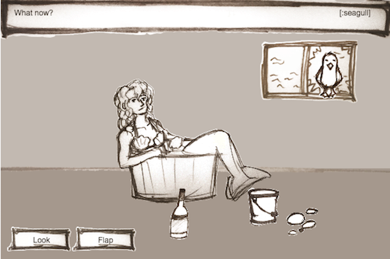

# The Mermaid Situation 

Click your way out of the room!

Use space to drop the current action.

Made with <3 and ClojureScript for Ludum Dare 37.

## Usage

Run `lein compile` command and open `index.html` in your browser.

For interactive development run `lein cljsbuild auto` command. This command will be recompiling cljs to js each time you modify `core.cljs` and you can see result immediately by refreshing page.

## License

Copyright © 2016 FIXME

Distributed under the Eclipse Public License either version 1.0 or (at
your option) any later version.
